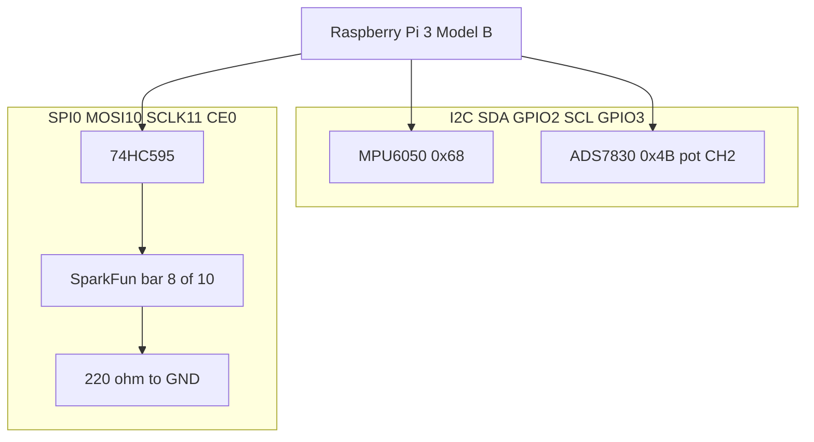

# Multi-Bus Sensor Dashboard (Raspberry Pi)

**Buses covered:** I2C (MPU6050 + ADS7830), SPI (74HC595), GPIO (LCD1602 4-bit)

## Hardware Topology

- **I2C** `/dev/i2c-1` (3.3V)
  - **MPU6050: Accelerometer/gyro/Temp** @ `0x68` (AD0=LOW - address wiring config)
  - **ADS7830: Potentiometer (8-bit ADC)** @ `0x4B` (Freenove module; A0/A1 high, fixed address)
    - Potentiometer input on **CH2** (Freenove projects board wiring)
- **SPI: Output expander for LED array** `/dev/spidev0.0`
  - **74HC595**: one 8-bit chip (not three). Datasheet “3-state” means Q0–Q7 can be High / Low / Hi-Z via `OE`; internally it is an 8-stage shift register plus an 8-bit latch.
  - **SPI map**: SER=MOSI (GPIO10), SRCLK=SCLK (GPIO11), RCLK=CE0 (GPIO8)
  - Tie **OE to GND** (outputs enabled) and **SRCLR / MR to 3.3V** (do not clear).
  - SparkFun 10-segment bar: use 8 segments. **Anodes → Q0–Q7**, **cathodes → 220Ω → GND**. If resistors are on the ground side and nothing lights, rotate the bar 180°.
- **LCD1602 (parallel, 4-bit): LCD connection** via **GPIO** using **libgpiod**
  - Default pin mapping (BCM): `RS=17`, `E=27`, `D4=22`, `D5=23`, `D6=24`, `D7=25`
  - RW → GND (write-only), VCC → 5V, GND → GND, VO → contrast pot (approx 0.3–0.6V)

## Wiring Diagram (as built)

Not wired yet: LCD1602, Arduino UNO.


GitHub inline preview (Mermaid):



Editable SVG (IDE / browser): [`docs/HL-diagram.svg`](docs/HL-diagram.svg)

## Software Setup

```bash
sudo raspi-config            # Enable I2C and SPI
sudo apt update
sudo apt install -y build-essential cmake git libi2c-dev i2c-tools libgpiod-dev
```

## Build & Run

```bash
mkdir build && cd build
cmake ..
make
ctest --output-on-failure   # host-side unit tests (protocol + LED bar math)
./app --test-hc595          # SPI only: walk Q0-Q7 then fill LED bar (no I2C/LCD/pot)
./app --no-lcd              # I2C + SPI only while LCD is unwired (no sudo if in i2c/spi groups)
./app                       # full dashboard once LCD is wired (prefer without sudo if in gpio group)
```

### Hardware-in-the-loop (on the Pi)

```bash
chmod +x scripts/hil_test.sh
./scripts/hil_test.sh                  # smoke: i2cdetect + 8 s app run
STRICT_POT=1 ./scripts/hil_test.sh     # also fail if pot not moved during capture
```

## Cursor / review process

This repo consumes skills from the personal `sdlc-skills` collection.

- Review rule: `.cursor/rules/embedded-code-review.mdc` (adapter; canonical
  source lives in `sdlc-skills`)
- Repo defaults: `.cursor/rules/project-context.mdc`
- Architecture: `docs/architecture.md`
- Local reviews only: `reviews/<path-mirroring-source>/<YYYY-MM-DD>_<short-hash>.md`
  (gitignored; do not commit or push)

Open this directory as the Cursor workspace so those rules load.

## Test milestones (current project status)

- Initial build on Raspberry Pi 3 Model B Rev 1.2: **Completed** — `app` builds on target (confirmed).
- Test on target device (functional/system testing): **In progress**
  - **MPU6050** @ `0x68`: **Verified** — accel/gyro/temp readings sane on hardware (`--no-lcd` run).
  - **ADS7830** @ `0x4B` (CH2 pot): **Verified** — `Pot=` tracks knob; HIL smoke + operator confirm.
  - **74HC595** / SPI LED bar: **Verified** — walk/bar via `--test-hc595`; bar tracks pot under `./app --no-lcd`.
  - **LCD1602** / GPIO: **Not started** — display not wired; use `./app --no-lcd` until GPIO lines are connected.
- Unit testing: **In progress** — `ads7830_protocol_test` and `hc595_bar_test` via `ctest` (2/2 on Pi).
- System testing / integration: **Partial** — MPU6050 + ADS7830 + 74HC595 + LED bar integrated without LCD; LCD still outstanding. Full HIL script PASS on Pi (`i2cdetect`, `--test-hc595`, `--no-lcd` smoke).

