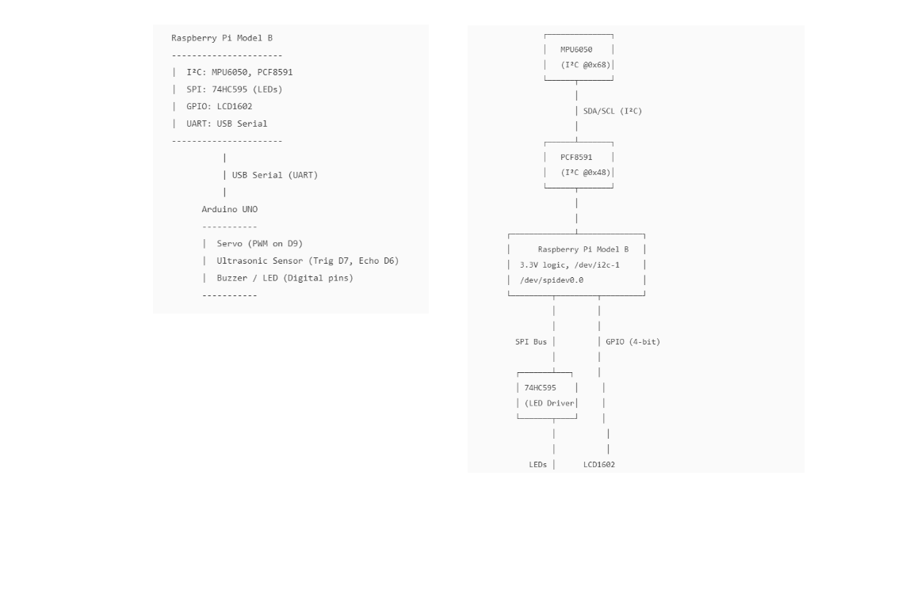

# Multi-Bus Sensor Dashboard (Raspberry Pi)

**Buses covered:** I2C (MPU6050 + ADS7830), SPI (74HC595), GPIO (LCD1602 4-bit)

## Hardware Topology

- **I2C** `/dev/i2c-1` (3.3V)
  - **MPU6050: Accelerometer/gyro/Temp** @ `0x68` (AD0=LOW - address wiring config)
  - **ADS7830: Potentiometer (8-bit ADC)** @ `0x4B` (Freenove module; A0/A1 high, fixed address)
    - Potentiometer input on **CH2** (Freenove projects board wiring)
- **SPI: Output expander for LED array** `/dev/spidev0.0`
  - **74HC595**: SER=MOSI (GPIO10), SRCLK=SCLK (GPIO11), RCLK=CE0 (GPIO8)
- **LCD1602 (parallel, 4-bit): LCD connection** via **GPIO** using **libgpiod**
  - Default pin mapping (BCM): `RS=17`, `E=27`, `D4=22`, `D5=23`, `D6=24`, `D7=25`
  - RW → GND (write-only), VCC → 5V, GND → GND, VO → contrast pot (approx 0.3–0.6V)

## Wiring Diagram

Source: [`docs/HL-diagram.svg`](docs/HL-diagram.svg) (ADS7830 @ `0x4B`, MPU6050 @ `0x68`).



Regenerate PNG after editing the SVG:

```bash
rsvg-convert -h 520 docs/HL-diagram.svg -o docs/HL-diagram.png
```

## Software Setup

```bash
sudo raspi-config            # Enable I2C and SPI
sudo apt update
sudo apt install -y build-essential cmake git libi2c-dev i2c-tools libgpiod-dev
```

## Build & Run

```bash
mkdir build && cd build
cmake ..
make
ctest --output-on-failure   # host-side unit tests (protocol + LED bar math)
./app --no-lcd              # I2C + SPI only while LCD is unwired (no sudo if in i2c/spi groups)
./app                       # full dashboard once LCD is wired (prefer without sudo if in gpio group)
```

### Hardware-in-the-loop (on the Pi)

```bash
chmod +x scripts/hil_test.sh
./scripts/hil_test.sh                  # smoke: i2cdetect + 8 s app run
STRICT_POT=1 ./scripts/hil_test.sh     # also fail if pot not moved during capture
```

## Cursor / review process

This repo consumes skills from the personal `sdlc-skills` collection.

- Review rule: `.cursor/rules/embedded-code-review.mdc` (adapter; canonical
  source lives in `sdlc-skills`)
- Repo defaults: `.cursor/rules/project-context.mdc`
- Architecture: `docs/architecture.md`
- Local reviews only: `reviews/<path-mirroring-source>/<YYYY-MM-DD>_<short-hash>.md`
  (gitignored; do not commit or push)

Open this directory as the Cursor workspace so those rules load.

## Test milestones (current project status)

- Initial build on Raspberry Pi Model B 2 SoC: **Completed** — `app` builds on target (confirmed).
- Test on target device (functional/system testing): **In progress**
  - **MPU6050** @ `0x68`: **Verified** — accel/gyro/temp readings sane on hardware (`--no-lcd` run).
  - **ADS7830** @ `0x4B` (CH2 pot): **Partial** — driver reads without I2C errors; pot sweep and LED-bar response still to be confirmed by operator.
  - **74HC595** / SPI LED bar: **Not verified** — no formal check that bar tracks pot value yet.
  - **LCD1602** / GPIO: **Not started** — display not wired; use `./app --no-lcd` until GPIO lines are connected.
- Unit testing: **In progress** — `ads7830_protocol_test` and `hc595_bar_test` run via `ctest`; ADS7830 I2C read path covered by HIL script.
- System testing / integration: **Planned** — full stack (MPU6050 + ADS7830 + 74HC595 + LCD1602) once pot sweep and LCD wiring are complete.

